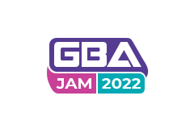

# GBAJAM22 Assets

  

To learn more, see the [itch.io](https://itch.io/jam/gbajam22) page.

## Teaser Cart

https://user-images.githubusercontent.com/14352721/180994309-1d70696f-3310-43b0-b2fa-20b8e6fc1423.mp4

Source code for the teaser cart (made with [Butano](https://github.com/GValiente/butano)) can be found in /cart folder. And you can download the cart rom [here](https://github.com/gbajam22/gbajam22.github.io/releases/download/cart/cart.gba)

## Vector Logo

## 240x160

Perfectly sized and transparent for your gba!

## 630x500

## 2000x250

## Credits

+ The font for Jam | 2022 is [Montserrat](https://github.com/JulietaUla/Montserrat) and is available under the [Open Font License](https://scripts.sil.org/cms/scripts/page.php?site_id=nrsi&id=OFL)
+ The pixel font included in the cart comes from the awesome [BPCore-Engine](https://github.com/evanbowman/BPCore-Engine) (A GBA game engine that uses Lua).
+ One of the older logo variations uses a background that requires attribution from [Ben 3D](https://www.youtube.com/watch?v=xaeIuEY-jNo).
+ The A icon and the mode7 background (from the rom) are free use and licensed as [public domain (CC0))](https://creativecommons.org/share-your-work/public-domain/cc0/).
+ Cart music is *what is funk?*, from *Jester*, licensed under the [Attribution Non-commercial Share Alike license (CC BY-NC-SA 4.0)](https://creativecommons.org/licenses/by-nc-sa/4.0/).
