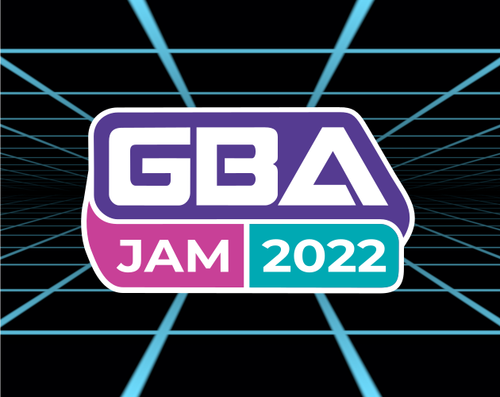
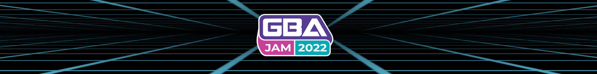

# GBAJAM22 Assets

  

To learn more, see the [itch.io](https://itch.io/jam/gbajam22) page.

## Teaser Cart

https://user-images.githubusercontent.com/14352721/180994309-1d70696f-3310-43b0-b2fa-20b8e6fc1423.mp4

Source code for the teaser cart (made with [Butano](https://github.com/GValiente/butano)) can be found in /cart folder. And you can download the cart rom [here](https://github.com/gbajam22/gbajam22.github.io/releases/download/cart/cart.gba)

## Vector Logo

## 240x160

## 630x500

## 2000x250

